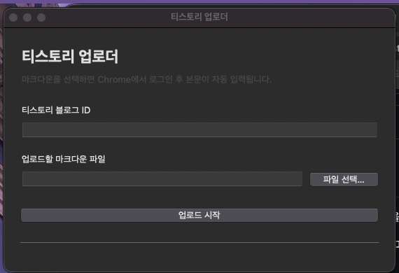

# 티스토리 업로더

UpNote, Notion, Obsidian 등에서 내보낸 마크다운 파일을 티스토리 글쓰기 화면에 자동 입력하는 macOS 데스크톱 앱입니다.

티스토리 Open API 종료 이후에도 마크다운 본문과 로컬 이미지를 티스토리 에디터에 쉽게 옮길 수 있도록 만들었습니다.



## 가장 쉬운 설치 방법

### 1. 앱 다운로드

아래 파일을 다운로드합니다.

[티스토리 업로더.zip 다운로드](release/티스토리%20업로더.zip)

### 2. 압축 해제

다운로드한 `티스토리 업로더.zip`을 더블클릭해 압축을 풉니다.

### 3. 앱 설치

압축을 풀면 나오는 `티스토리 업로더.app`을 `응용 프로그램` 폴더로 드래그합니다.

### 4. 처음 실행

처음 실행할 때 macOS 보안 안내가 뜰 수 있습니다.

1. `티스토리 업로더.app`을 우클릭합니다.
2. `열기`를 누릅니다.
3. 확인 창에서 다시 `열기`를 누릅니다.

처음 한 번만 이렇게 열면 이후에는 일반 앱처럼 실행할 수 있습니다.

## 사용 방법

1. `티스토리 업로더.app`을 실행합니다.
2. 티스토리 블로그 ID를 입력합니다.
   - 예: 블로그 주소가 `https://myblog.tistory.com`이면 `myblog`만 입력합니다.
3. 업로드할 `.md` 마크다운 파일을 선택합니다.
4. `업로드 시작`을 누릅니다.
5. Chrome 창이 열리면 티스토리에 로그인합니다.
   - 최초 1회만 로그인하면 앱 전용 Chrome 프로필에 세션이 저장됩니다.
6. 티스토리 글쓰기 화면이 열리면 제목과 본문이 자동으로 입력됩니다.
7. 내용을 확인한 뒤 Chrome에서 `완료` 버튼을 눌러 발행합니다.

## 지원하는 내용

- 마크다운 파일 자동 변환
- 로컬 이미지 자동 삽입
- 티스토리 글쓰기 화면 자동 열기
- 제목과 본문 자동 입력
- 최초 로그인 이후 세션 유지
- 앱 전용 Chrome 프로필 사용

## 앱 데이터 위치

앱은 로그인 세션과 마지막 입력한 블로그 ID를 아래 위치에 저장합니다.

```text
~/Library/Application Support/TistoryUploader/
```

주요 파일은 다음과 같습니다.

```text
chrome-profile/    앱 전용 Chrome 로그인 세션
settings.json      마지막으로 입력한 블로그 ID
```

자동 로그인을 초기화하고 싶으면 위 폴더를 삭제한 뒤 앱을 다시 실행하면 됩니다.

## 문제가 있을 때

### macOS에서 앱을 열 수 없다고 나오는 경우

앱을 더블클릭하지 말고 우클릭 후 `열기`를 선택하세요. 확인 창에서도 `열기`를 누르면 실행됩니다.

### Chrome이 열리지 않는 경우

Google Chrome이 설치되어 있어야 합니다. Chrome을 설치하거나 최신 버전으로 업데이트한 뒤 다시 실행하세요.

### 로그인했는데 자동 입력이 안 되는 경우

티스토리 글쓰기 화면이 완전히 로딩될 때까지 기다려 주세요. 그래도 입력되지 않으면 앱에서 다시 `업로드 시작`을 눌러 재시도하세요.

### 이전 자동화 Chrome이 남아 있다고 나오는 경우

앱이 열었던 Chrome 창을 모두 닫고 다시 실행하세요.

## 개발자용 실행

소스에서 직접 실행하려면 아래 명령을 사용합니다.

```bash
git clone https://github.com/SeongGi/notion-upnote-to-tistory.git
cd notion-upnote-to-tistory
./setup.sh
./run.sh
```

macOS 앱을 다시 빌드하려면 다음을 실행합니다.

```bash
./build_macos_app.sh
```

빌드 결과는 아래 경로에 생성됩니다.

```text
dist/티스토리 업로더.app
```

배포용 zip은 `dist/티스토리 업로더.app`을 압축해 `release/티스토리 업로더.zip`으로 올리면 됩니다.

## 주요 파일

```text
tistory_uploader.py       마크다운 변환과 티스토리 Chrome 자동화
mac_app.py                macOS 데스크톱 앱 UI
setup.sh                  개발 환경 설치 스크립트
run.sh                    개발용 실행 스크립트
build_macos_app.sh        macOS 앱 빌드 스크립트
assets/                   앱 아이콘
release/티스토리 업로더.zip  사용자 다운로드용 앱 압축 파일
```

## 라이선스

이 프로젝트는 MIT 라이선스에 따라 배포됩니다.
